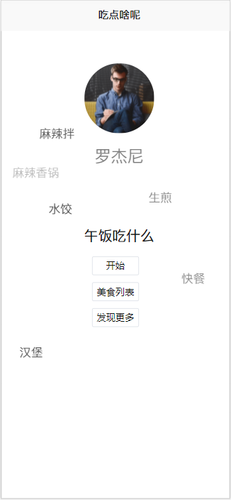
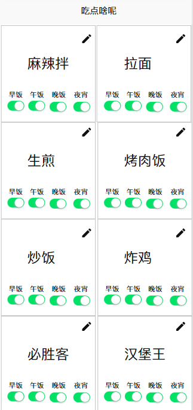
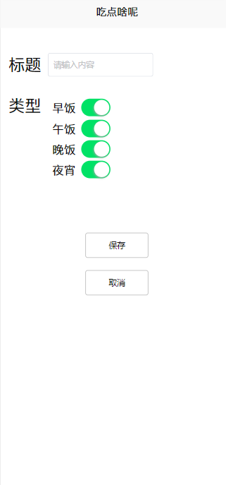

# 吃点啥呢(微信小程序)
- 每天不知道吃点啥？让小程序来帮你解决！

# 功能：
1. 获取用户信息: 头像、姓名 - done
2. 获取用户定位 - done
2-1. 自动搜索附近美食 - need to do
3. 轮询美食列表 - done
4. 自定义美食列表 - need to do
5. 发现更多: 跳转到美团点评小程序 - done
6. 关于 - need to do

# 项目日志
update 10.19:
- 添加发现更多功能

# 效果图

